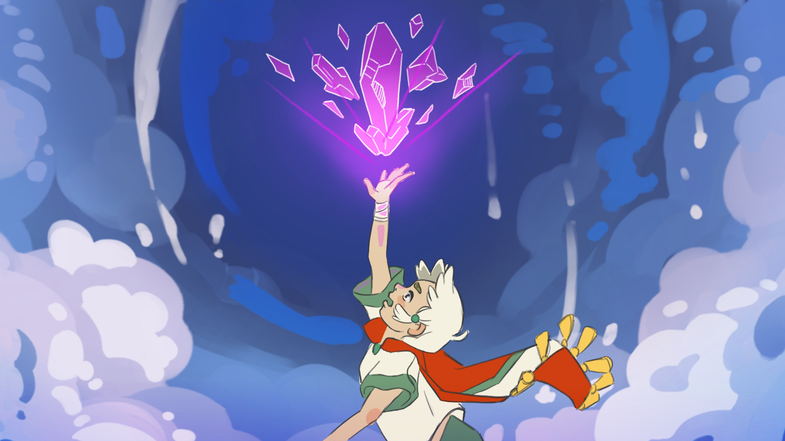

# Tale of Two Sides

https://voithos.itch.io/tale-of-two-sides

Built for Global Game Jam 2022. Theme: **Duality**

## Credits

All art, sounds, music, and code was made by our 4-person team in 48 hours.

- [Daisy Muradyan](https://ladychamomile.ink/)
- [Diego Gonzalez](https://drgvdg.itch.io/)
- [Levi Lindsey](https://www.levi.dev/)
- [Zaven Muradyan](https://voithos.io/)

## Deployment

### Automatic

Creating a new release in Github will trigger a Github Action that will publish to itch.io.

### Manual

Deploying to itch.io can be done via the `butler` tool. First, some one-time setup:

1. Download export templates in Godot.
1. [Install `butler`](https://itch.io/docs/butler/installing.html) and [login to your itch.io account](https://itch.io/docs/butler/login.html).

Then to deploy an HTML build:

1. Export HTML from Godot.
1. Push the exported HTML directory: `butler push dist/html/ voithos/tale-of-two-sides:html5`
1. Play it at https://voithos.itch.io/tale-of-two-sides

---

  

